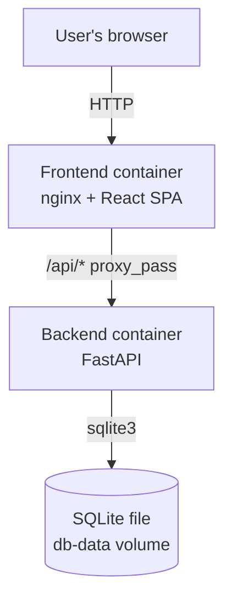

# Architecture — Expense Tracker

## System Context

## Containers
- **frontend** — nginx 1.27-alpine serving a static Vite/React 18 SPA build; also
  reverse-proxies `/api/` to the backend service by its compose network name
  (confirmed: `frontend/Dockerfile`, `frontend/nginx.conf`). Exposed on host port 8090
  (confirmed: `docker-compose.yml`).
- **backend** — FastAPI app served by uvicorn on port 8000, not published to the host
  directly — only reachable through the frontend's nginx proxy in the compose setup
  (confirmed: `backend/Dockerfile`, `docker-compose.yml`).
- **db** — a single SQLite file at the path in `EXPENSE_DB_PATH`, persisted via the
  `db-data` named volume mounted at `/data` in the backend container (confirmed:
  `backend/app/db.py`, `docker-compose.yml`). No separate database process — SQLite is
  embedded in the backend container.

## Boundary Rules
- All SQL lives in `backend/app/repositories/` — routers and services never touch
  `sqlite3` or a connection directly (confirmed: only `repositories/expenses.py`
  imports `app.db`).
- Layering is router → service → repository → db, one direction only: routers call
  services, services call repositories, repositories call `app.db`. A repository
  never imports a service or router; a service never imports a router (confirmed: import
  graph in `backend/app/{routers,services,repositories}/expenses.py`).
- Request/response validation is Pydantic models in `backend/app/models/`, applied at
  the router boundary — services and repositories operate on plain dicts/primitives,
  not model instances, once past the router (confirmed: `services/expenses.py` returns
  `dict`, `repositories/expenses.py` operates on plain args/dicts).
- The frontend never calls the backend except through `frontend/src/api/client.ts` — all
  components/hooks route through `apiFetch`, and all requests go through the `/api`
  prefix that nginx proxies (confirmed: `api/client.ts` doc comment, no other `fetch(`
  call sites under `frontend/src/`).
- `id` and `created_at` on an expense are server-owned: no request model
  (`ExpenseCreate`/`ExpenseUpdate`) accepts either field, so no client input can set or
  overwrite them (confirmed: `backend/app/models/expense.py`).
- The database path is never hardcoded in application code — it is always read from the
  `EXPENSE_DB_PATH` environment variable via `app.db.get_db_path()`, defaulting to
  `expenses.db` only when unset (confirmed: `backend/app/db.py`). This is what lets
  tests point at an isolated temp file (`backend/conftest.py`) instead of the real
  database.

## Open questions (human to answer)
- No API-layer identity/auth exists (see PRODUCT.md open question) — if auth is added,
  a boundary rule for where identity is established and checked (e.g. "auth is
  enforced in the router layer only") should be added here as an ADR.

## Governing ADRs
- [ADR-0001 — Record architecture decisions](../adr/0001-record-architecture-decisions.md)
<!-- add links as ADRs are written, e.g. [ADR-0002 title](../adr/0002-slug.md) -->
