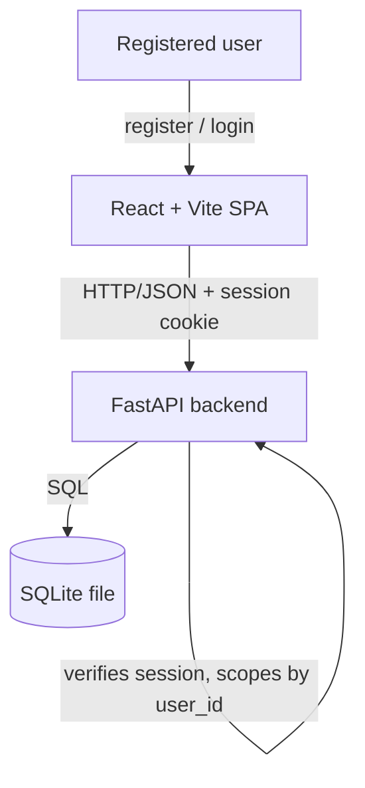
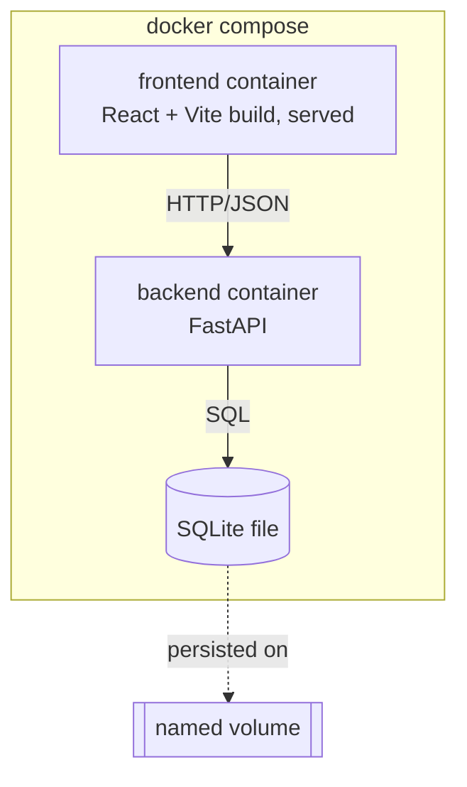

# Architecture — Expense Tracker

> Greenfield draft: intended architecture for a project with no code yet. Review and ratify.

## System Context

## Containers
- **Web SPA** — React 18 + TypeScript, built with Vite. Renders the UI and calls the backend
  over HTTP/JSON through a typed API client. No direct DB access. Shows Register/Login when
  unauthenticated; the expense app only once a session exists.
- **API backend** — FastAPI (Python). Exposes a REST/JSON API. Layered internally as
  `router → service → repository`. Owns all business rules, session verification, and the
  only path to the database.
- **Database** — SQLite, a single local file. Accessed exclusively by the backend's repository
  layer. Every user-owned row (expenses, ...) carries a `user_id`; every query is scoped to it.

## Deployment Topology

- The stack runs via **`docker compose up`**, bringing up two service containers — **frontend**
  and **backend** — plus the SQLite database the backend owns.
- The **frontend** container serves the built React + Vite SPA; the **backend** container runs
  the FastAPI app and is the only process that opens the SQLite file.
- The SQLite file lives on a **named Docker volume**, so recorded data persists across
  `docker compose down` / `up`. The DB file is never baked into an image or committed to git.

## Boundary Rules
- The SPA never touches the database directly — all data flows through the FastAPI HTTP API.
- All database access goes through the repository layer; services and routers never issue SQL directly.
- Business/domain logic lives in the service layer — not in routers (thin) and not in repositories (SQL only).
- All I/O crossing the API boundary is validated/serialized with Pydantic models.
- Currency amounts cross every boundary as integer whole Nepalese Rupees (NPR), never floats.
- Every `/api/expenses*` and `/api/summary` route requires an authenticated session (an httpOnly
  signed cookie); the backend is the only place that verifies it and the only place a `user_id`
  is derived from it — never trust a client-supplied user id.
- A user's expenses are reachable only through their own authenticated session — no route,
  query, or aggregate may return or act on another user's rows.

## Governing ADRs
- [ADR-0001 — Record architecture decisions](../adr/0001-record-architecture-decisions.md)
<!-- add links as ADRs are written, e.g. [ADR-0002 title](../adr/0002-slug.md) -->
