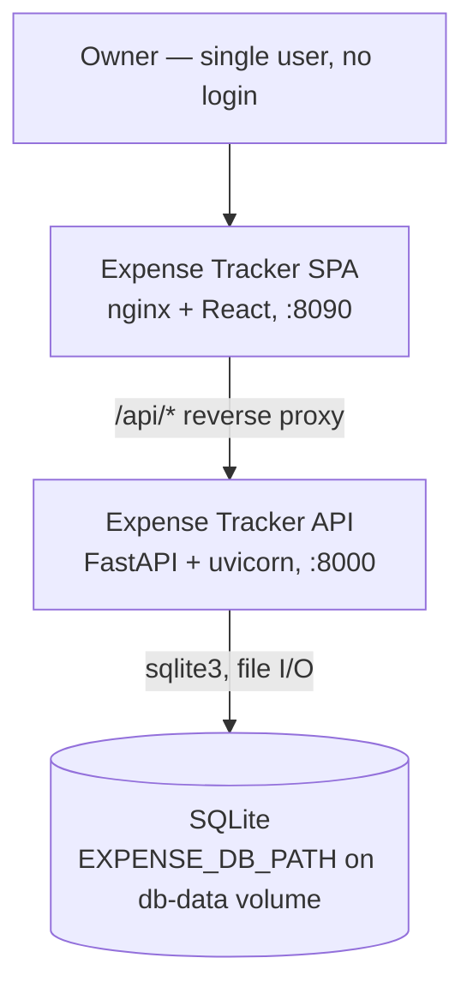

# Architecture — Expense Tracker

Two containers behind one origin: an nginx-served React SPA that also reverse-proxies `/api/`
to a FastAPI service, which owns a single SQLite file on a Docker volume. No auth, no queues,
no third-party services — the whole system is self-contained.

## System Context

## Containers

| Container | Tech | Runs / exposes | Owns |
|---|---|---|---|
| **Frontend** (`frontend/`) | React 18 + TypeScript, Vite build, Tailwind CSS (shadcn/ui token conventions), Recharts, lucide-react; served by nginx 1.27-alpine | Published `8090 → 80` (`docker-compose.yml`); dev server on 5173 (`frontend/vite.config.ts`) | All UI, client state, theme persistence in `localStorage` |
| **Backend** (`backend/`) | Python 3.12, FastAPI 0.111 + Pydantic v2, uvicorn; deps fully pinned in `backend/requirements.txt` | Port 8000 inside the compose network — **not** published to the host | The HTTP API under `/api`, `/health`, all domain logic, the DB schema |
| **Datastore** | SQLite via the stdlib `sqlite3` module — no ORM | File at `EXPENSE_DB_PATH` (`/data/expenses.db` in Docker, on the `db-data` named volume; `expenses.db` in the CWD otherwise) | The single `expenses` table (`backend/app/db.py`) |

Notes:
- The **only** network path from the browser to the API is nginx's `location /api/` →
  `http://backend:8000/api/` (`frontend/nginx.conf`). The API has no published host port, so it
  is unreachable except through the frontend container.
- Same-origin by construction: the SPA calls relative `/api/...` (`frontend/src/api/client.ts`),
  so there is no CORS configuration and none is needed. In dev, Vite proxies `/api` to
  `VITE_API_TARGET` (default `http://localhost:8000`).
- Schema creation is idempotent and happens at app boot — `create_app()` calls `init_db()`
  (`backend/app/main.py:12-13`). There is no migration tool; schema changes must stay
  `CREATE TABLE IF NOT EXISTS`-compatible or introduce one (open question below).

## Boundary Rules

Backend layering — strictly one direction, `router → service → repository → sqlite3`:
- **Routers do HTTP only.** Parse/validate via Pydantic models, delegate to the service, map a
  service result to a status code. No SQL, no `sqlite3` import, no business rules in
  `backend/app/routers/`. Today: routers translate a `None`/`False` service result into
  `404` (`backend/app/routers/expenses.py:25-36`).
- **Services hold domain logic and own the clock.** `backend/app/services/` is the only place a
  timestamp is minted (`datetime.now(timezone.utc)`) and the only place cross-record rules live
  (e.g. the summary zero-filling every category). Services never touch `sqlite3` and never raise
  `HTTPException` — they return values/`None` and let the router choose the status code.
- **Repositories are the only place SQL exists.** `backend/app/repositories/expenses.py` is the
  sole holder of SQL strings against the `expenses` table, and `backend/app/db.py::get_connection`
  is its only connection source. Repositories take and return plain values/dicts — they never
  import Pydantic models and never receive a request object.
- **Layers never skip or reverse.** A router must not call a repository; a repository must not
  call a service; nothing under `backend/app/` imports from `backend/tests/`.

Data & identity:
- **`id` and `created_at` are server-owned.** No request body can carry them — the write models
  deliberately omit both (`backend/app/models/expense.py:31-40`), and `UPDATE` never appears in
  the `SET` clause for either column (`backend/app/repositories/expenses.py:40-65`).
- **There is no identity flow.** No auth middleware, no session, no principal, no per-user
  filtering. Every request operates on the whole store. Introducing a user concept is an
  architectural change and needs an ADR — do not add an ad-hoc user column or header check.
- **The DB path is injected, never hardcoded at a call site.** Only `backend/app/db.py` reads
  `EXPENSE_DB_PATH`; tests point it at a temp file, Docker at the volume
  (`backend/conftest.py`, `backend/Dockerfile`).

Frontend layering — `component → hook → api client → fetch`:
- **`frontend/src/api/client.ts` is the only module that calls `fetch`.** Components and hooks
  never construct a URL or a request; every endpoint gets a typed function there. (Test files
  legitimately stub the global `fetch` — that is the seam they assert against.)
- **Data-loading state lives in hooks** (`frontend/src/hooks/`): each exposes
  `{ data, loading, error, reload }`. Components render those three states and call `reload`;
  they do not own fetch lifecycles.
- **`App.tsx` is the composition root.** It owns the cross-feature wiring — which expense is
  being edited, and refreshing list + summary together after any mutation. Feature components
  under `frontend/src/features/<feature>/` are presentational: props in, callbacks out.
- **Theme is one owner.** `useTheme` is the only writer of the `dark` class on
  `document.documentElement` and of the `theme` `localStorage` key; components consume the
  toggle, they do not set classes themselves.
- **Colors come from CSS variables, not literals.** Tailwind semantic tokens
  (`bg-card`, `text-muted-foreground`, …) map to the HSL variables in `frontend/src/index.css`,
  so light/dark both work. Known exception: the category palette is hardcoded hex in
  `frontend/src/features/summary/CategorySummary.tsx` (flagged in-file as not yet theme-aware).

Contract boundary:
- **The API shape is the contract, in snake_case.** `by_category`, `created_at` etc. cross the
  wire unchanged; the TypeScript interfaces in `frontend/src/api/client.ts` mirror the Pydantic
  models in `backend/app/models/expense.py` field-for-field. Change one and you must change the
  other in the same task — there is no code generation and no adapter layer to absorb drift.
- **The category set and the money unit are duplicated by necessity** (`CATEGORIES` exists in
  both `backend/app/models/expense.py:11` and `frontend/src/api/client.ts:7`). Keep them
  identical; amounts are integer whole NPR on both sides.

## Governing ADRs
- [ADR-0001 — Record architecture decisions](../adr/0001-record-architecture-decisions.md)
<!-- add links as ADRs are written, e.g. [ADR-0002 title](../adr/0002-slug.md) -->

Architectural decisions visible in the code but **not yet recorded as ADRs** — worth writing up
(each is inferred from the code, not from a stated decision):
- SQLite + raw `sqlite3` instead of an ORM, with schema bootstrap at boot and no migration tool.
- Layered `router / service / repository` split in a project this small.
- nginx-as-reverse-proxy for same-origin `/api`, with the backend port unpublished.
- No authentication at all (see the `SESSION_SECRET` open question in `PRODUCT.md`).

Open architecture question for the human: there is no migration path. Any change to the
`expenses` table beyond an additive `CREATE TABLE IF NOT EXISTS` will silently not apply to an
existing volume — decide whether that is accepted (recreate the volume) or whether a migration
mechanism is needed before the next schema-touching feature.
