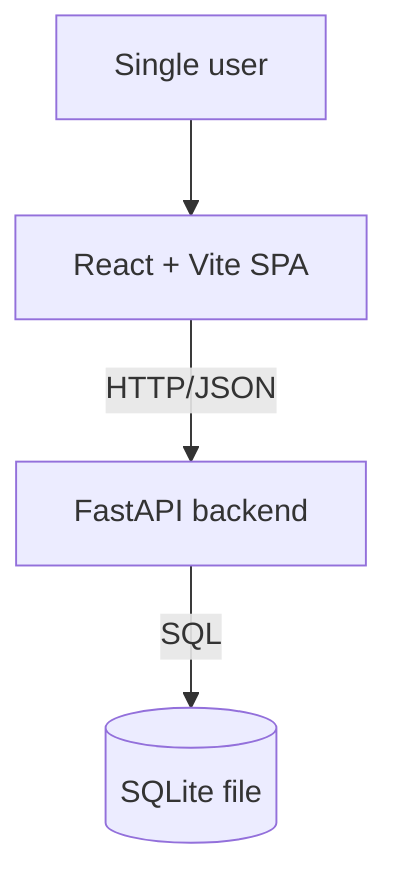

# Architecture — Expense Tracker

> Greenfield draft: intended architecture for a project with no code yet. Review and ratify.

## System Context

## Containers
- **Web SPA** — React 18 + TypeScript, built with Vite. Renders the UI and calls the backend
  over HTTP/JSON through a typed API client. No direct DB access.
- **API backend** — FastAPI (Python). Exposes a REST/JSON API. Layered internally as
  `router → service → repository`. Owns all business rules and the only path to the database.
- **Database** — SQLite, a single local file. Accessed exclusively by the backend's repository layer.

## Boundary Rules
- The SPA never touches the database directly — all data flows through the FastAPI HTTP API.
- All database access goes through the repository layer; services and routers never issue SQL directly.
- Business/domain logic lives in the service layer — not in routers (thin) and not in repositories (SQL only).
- All I/O crossing the API boundary is validated/serialized with Pydantic models.
- Currency amounts cross every boundary as integer minor units (cents), never floats.

## Governing ADRs
- [ADR-0001 — Record architecture decisions](../adr/0001-record-architecture-decisions.md)
<!-- add links as ADRs are written, e.g. [ADR-0002 title](../adr/0002-slug.md) -->
